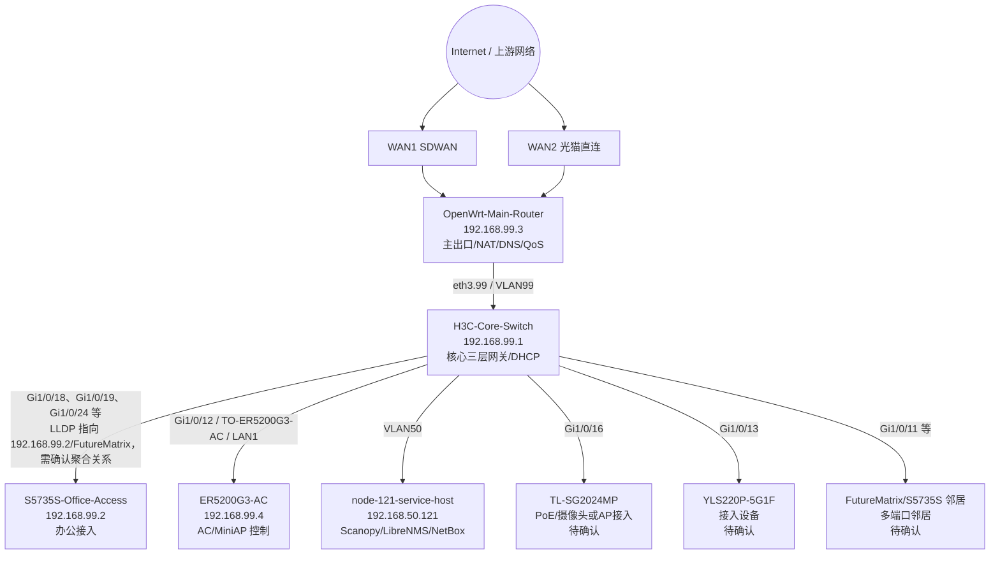

# 深澜网络拓扑草图（Scanopy / LibreNMS / NetBox）

生成时间：2026-06-19 18:55 Asia/Shanghai

本文件是基于 `node-121` 上三个系统生成的第一版拓扑草图：

- Scanopy：当前仅确认服务运行，用于后续主动发现/补充终端资产。
- LibreNMS：以 SNMPv3 监控数据为主，提供设备、端口、LLDP/邻居链路证据。
- NetBox：作为资产/IPAM 结构化底账，提供 VLAN、网段、设备清单。

> 注意：本文件不包含任何密码、SNMP 凭据、Token 或原始配置备份。端口级链路中 LLDP 重复/厂商显示不一致的项目标记为“待确认”。

## 当前结论

依靠这三个程序已经可以构建出“核心层 + 出口 + 接入/无线控制 + 运维服务”的初始拓扑：

- `LibreNMS` 已 SNMPv3 纳管 5 个关键设备：`node-121`、`H3C-Core-Switch`、`S5735S-Office-Access`、`OpenWrt-Main-Router`、`ER5200G3-AC`。
- `NetBox` 已有深澜空间 VLAN/IPAM 底账，可承载最终资产拓扑和机房/区域归属。
- `Scanopy` 可继续作为自动发现入口，后续用于补足非网管终端、摄像头、AP、NAS、投屏/中控设备等。
- 第一版拓扑能准确表达主干关系；若要达到“施工图/交付图”级别，还需要逐口确认 H3C/S5735S 聚合、AP/PoE 交换机、各房间面板端口。

## 高层拓扑

## 设备清单（LibreNMS）

| 地址 | 显示名 | sysName | OS | 类型 | 状态 |
|---|---|---|---|---|---|
| `192.168.50.121` | `node-121-service-host` | `node-121` | `linux` | `server` | `1` |
| `192.168.99.1` | `H3C-Core-Switch` | `h3c` | `comware` | `network` | `1` |
| `192.168.99.2` | `S5735S-Office-Access` | `s5735s-office-access` | `vrp` | `network` | `1` |
| `192.168.99.3` | `OpenWrt-Main-Router` | `openwrt-main-router` | `linux` | `server` | `1` |
| `192.168.99.4` | `ER5200G3-AC` | `h3c` | `comware` | `network` | `1` |

## 已发现链路（LibreNMS links 表）

| 本端设备 | 本端端口 | 端口备注 | 对端名称 | 对端端口/标识 | 判断 |
|---|---|---|---|---|---|
| `192.168.99.1` | `GigabitEthernet1/0/1` | GigabitEthernet1/0/1 Interface | `h3c` | `CC 28 AA 07 E3 76 (cc28aa07e376)` | 已发现，待端口复核 |
| `192.168.99.1` | `GigabitEthernet1/0/11` | GigabitEthernet1/0/11 Interface | `FutureMatrix` | `GigabitEthernet0/0/23 (3cc78618af3f)` | 指向 S5735S/FutureMatrix，可能为上联/聚合，待确认 |
| `192.168.99.1` | `GigabitEthernet1/0/12` | TO-ER5200G3-AC | `H3C` | `lan1 (58b38ffeeadc)` | 高可信：H3C 核心到 ER5200G3 LAN1 |
| `192.168.99.1` | `GigabitEthernet1/0/13` | GigabitEthernet1/0/13 Interface | `YLS220P-5G1F` | `6 (9c47826ae6fb)` | 已发现，待端口复核 |
| `192.168.99.1` | `GigabitEthernet1/0/16` | GigabitEthernet1/0/16 Interface | `TL-SG2024MP` | `1 (9c4782462c2e)` | 已发现，待端口复核 |
| `192.168.99.1` | `GigabitEthernet1/0/18` | GigabitEthernet1/0/18 Interface | `192.168.99.2` | `D4 5D 64 D2 B9 6B (d45d64d2b96b)` | 指向 S5735S/FutureMatrix，可能为上联/聚合，待确认 |
| `192.168.99.1` | `GigabitEthernet1/0/18` | GigabitEthernet1/0/18 Interface | `FutureMatrix` | `GigabitEthernet0/0/2 (3cc78618ae78)` | 指向 S5735S/FutureMatrix，可能为上联/聚合，待确认 |
| `192.168.99.1` | `GigabitEthernet1/0/19` | GigabitEthernet1/0/19 Interface | `192.168.99.2` | `F8 E4 3B 85 56 F2 (f8e43b8556f2)` | 指向 S5735S/FutureMatrix，可能为上联/聚合，待确认 |
| `192.168.99.1` | `GigabitEthernet1/0/19` | GigabitEthernet1/0/19 Interface | `h3c` | `6C 1F F7 5E AF 46 (6c1ff75eaf46)` | 已发现，待端口复核 |
| `192.168.99.1` | `GigabitEthernet1/0/24` | VLAN120-Free-DHCP | `192.168.99.2` | `1A 4B 24 AC 8E A5 (1a4b24ac8ea5)` | 指向 S5735S/FutureMatrix，可能为上联/聚合，待确认 |
| `192.168.99.1` | `GigabitEthernet1/0/6` | GigabitEthernet1/0/6 Interface | `FutureMatrix` | `GigabitEthernet0/0/13 (3cc78635d757)` | 指向 S5735S/FutureMatrix，可能为上联/聚合，待确认 |
| `192.168.99.1` | `GigabitEthernet1/0/9` | GigabitEthernet1/0/9 Interface | `192.168.99.2` | `24 5A 5F 88 CA 44 (245a5f88ca44)` | 指向 S5735S/FutureMatrix，可能为上联/聚合，待确认 |
| `192.168.99.1` | `GigabitEthernet1/0/9` | GigabitEthernet1/0/9 Interface | `192.168.99.2` | `24 5A 5F 88 CA 6F (245a5f88ca6f)` | 指向 S5735S/FutureMatrix，可能为上联/聚合，待确认 |
| `192.168.99.1` | `GigabitEthernet1/0/9` | GigabitEthernet1/0/9 Interface | `192.168.99.2` | `24 5A 5F D6 B3 8E (245a5fd6b38e)` | 指向 S5735S/FutureMatrix，可能为上联/聚合，待确认 |
| `192.168.99.1` | `GigabitEthernet1/0/9` | GigabitEthernet1/0/9 Interface | `192.168.99.2` | `24 5A 5F D6 B6 2A (245a5fd6b62a)` | 指向 S5735S/FutureMatrix，可能为上联/聚合，待确认 |
| `192.168.99.1` | `GigabitEthernet1/0/9` | GigabitEthernet1/0/9 Interface | `192.168.99.2` | `68 DD B7 D2 59 2F (68ddb7d2592f)` | 指向 S5735S/FutureMatrix，可能为上联/聚合，待确认 |
| `192.168.99.1` | `Ten-GigabitEthernet1/0/28` | TO-Huawei5130 | `S5735S-Office-Access` | `GigabitEthernet0/0/25 (3cc78618af38)` | 已发现，待端口复核 |
| `192.168.99.2` | `GigabitEthernet0/0/25` | TO-H3C-Core-Uplink | `H3C` | `Ten-GigabitEthernet1/0/28` | S5735S 上联端口备注确认 |
| `192.168.99.2` | `GigabitEthernet0/0/9` | GigabitEthernet0/0/9 | `TL-ST2008` | ` (f86fb0769080)` | 已发现，待端口复核 |

## VLAN / IPAM（NetBox）

| VLAN | 名称 | 网段 | 说明 |
|---:|---|---|---|
| `10` | `VLAN10 office-wired` | `192.168.10.0/24` | Gateway 192.168.10.1/24 · office-wired |
| `11` | `VLAN11 room-vlan-a` | `192.168.11.0/24` | Gateway 192.168.11.1/24 · room-vlan-a |
| `12` | `VLAN12 room-vlan-b` | `192.168.12.0/24` | Gateway 192.168.12.1/24 · room-vlan-b |
| `13` | `VLAN13 room-vlan-c` | `192.168.13.0/24` | Gateway 192.168.13.1/24 · room-vlan-c |
| `19` | `VLAN19 reception` | `192.168.19.0/24` | Gateway 192.168.19.1/24 · reception |
| `20` | `VLAN20 ap-wireless-management` | `192.168.20.0/24` | Gateway 192.168.20.1/24 · ap-wireless-management |
| `30` | `VLAN30 nas-storage` | `192.168.30.0/24` | Gateway 192.168.30.1/24 · nas-storage |
| `40` | `VLAN40 monitoring` | `192.168.40.0/24` | Gateway 192.168.40.1/24 · monitoring |
| `50` | `VLAN50 showroom-server-central-control` | `192.168.50.0/23` | Gateway 192.168.50.1/23 · showroom-server-central-control |
| `60` | `VLAN60 wireless-service` | `192.168.60.0/23` | Gateway 192.168.60.1/23 · wireless-service |
| `70` | `VLAN70 workstation` | `192.168.70.0/24` | Gateway 192.168.70.1/24 · workstation |
| `80` | `VLAN80 hall-2` | `192.168.80.0/24` | Gateway 192.168.80.1/24 · hall-2 |
| `90` | `VLAN90 xr-studio` | `192.168.90.0/24` | Gateway 192.168.90.1/24 · xr-studio |
| `99` | `VLAN99 core-router-ac-management` | `192.168.99.0/24` | Gateway 192.168.99.1/24 · core-router-ac-management |
| `110` | `VLAN110 reserved-business` | `192.168.110.0/24` | Gateway 192.168.110.1/24 · reserved-business |
| `120` | `VLAN120 free-dhcp-ports` | `192.168.120.0/24` | Gateway 192.168.120.1/24 · free-dhcp-ports |
| `201` | `VLAN201 reserved-business` | `172.16.201.0/24` | Gateway 172.16.201.254/24 · reserved-business |

## 三个系统的分工建议

| 系统 | 当前作用 | 下一步 |
|---|---|---|
| Scanopy | 自动发现入口，适合补终端/服务/开放端口视角 | 开启定期扫描 VLAN 网段，把未知设备映射到 NetBox 候选资产 |
| LibreNMS | SNMPv3 监控和 LLDP/端口状态事实来源 | 持续 poll/discovery；重点复核 H3C 与 S5735S 的多端口邻居/聚合关系 |
| NetBox | 资产、VLAN、IPAM、最终拓扑底账 | 把已确认链路录入 Cable/Interface，把待确认链路保留为候选 |

## 待确认项

- H3C `GigabitEthernet1/0/18`、`1/0/19`、`1/0/24` 均发现与 `192.168.99.2` / `FutureMatrix` 相关邻居，需要确认是否为同一台 S5735S、链路聚合、级联或 LLDP 残留。
- OpenWrt 与 H3C 的物理端口在 LibreNMS 端没有形成完整 LLDP 双向链路；当前按已知 `eth3.99` / VLAN99 管理关系表达。
- `TL-SG2024MP`、`YLS220P-5G1F`、`FutureMatrix` 等下游设备还未纳入 SNMPv3/NetBox 正式资产。
- Scanopy 的发现结果尚未结构化写入 NetBox；后续应建立“发现 → 候选资产 → 人工确认 → NetBox 入库”的流程。

## 建议落地步骤

1. 在 LibreNMS 中确认所有关键设备 discovery/poll 周期正常。
2. 在 H3C/S5735S 上导出或查询 LLDP neighbor 和 interface description，复核聚合链路。
3. 将确认后的设备接口、线缆、VLAN membership 录入 NetBox。
4. 用 Scanopy 扫描各 VLAN 网段，补充 AP、摄像头、NAS、中控、投屏、终端等非核心资产。
5. Codex 重启后使用已安装的 `mcp-diagram-generator` 生成 `.drawio` 版本，作为可视化交付图。
